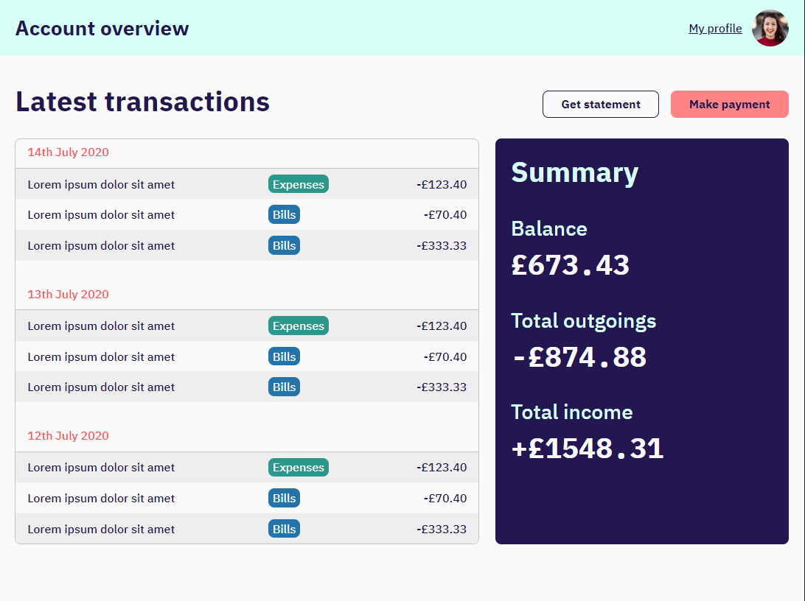

# TABLE OF CONTENTS

[Project Title](#project-title)
[Description](#description)
[Installation](#installation)
[Usage](#usage)
[Guidelines](#guidelines)
[Testing the Application](#testing-the-application)
[Github](#github)
[Contact Us](#contact-us)
[Licence](#licence)

## Project Title

CUBE CSS Dashboard

## Description

A banking dashboard that you build in the Piccalilli tutorial: Build a dashboard with CUBE CSS. [Check out the tutorial here](https://piccalil.li/tutorial/build-a-dashboard-with-cube-css/).

## Image of Project

## Github

https://github.com/Sho-ayb

## Deployed Application

[Dashboard Application](https://sho-ayb.github.io/cube-css-dashboard/)

## Licence

MIT License

Please click on the badge for more details on the licence.

